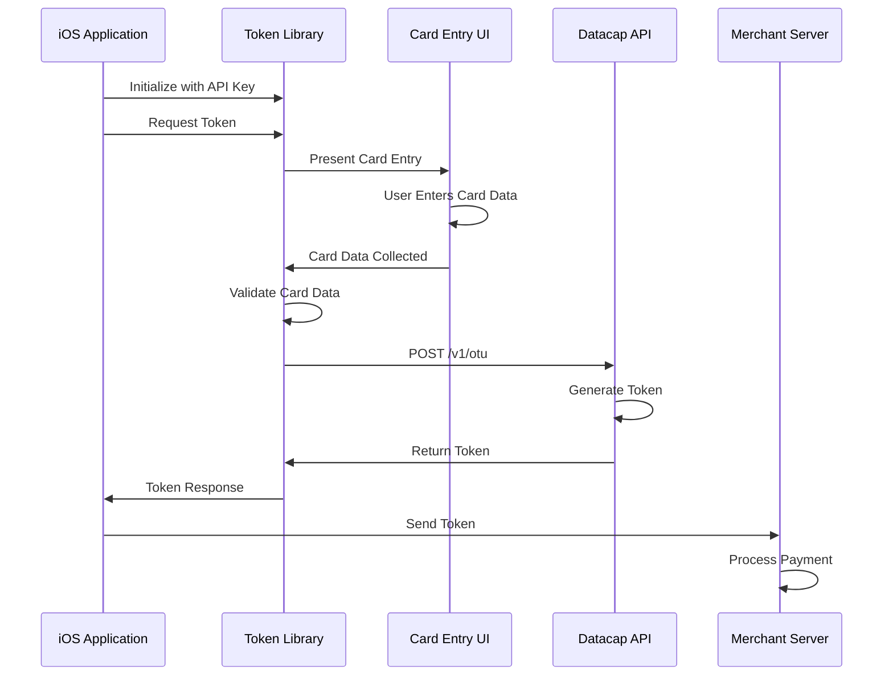
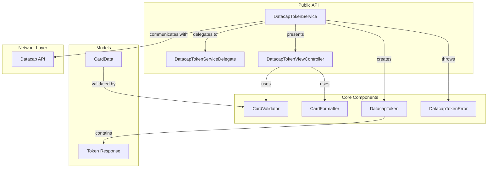
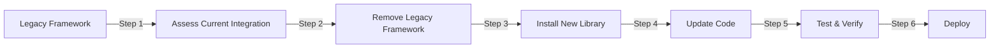

# Datacap Mobile Token iOS Library

<div align="center">
  
</div>


A secure, production-ready iOS library for payment card tokenization using Datacap's tokenization API. This library provides a streamlined integration path for iOS applications requiring PCI-compliant payment processing.

## Table of Contents

- [Overview](#overview)
- [Architecture](#architecture)
- [Requirements](#requirements)
- [Installation](#installation)
- [Quick Start](#quick-start)
- [API Reference](#api-reference)
- [Security Considerations](#security-considerations)
- [Testing](#testing)
- [Migration Guide](#migration-guide)
- [Support](#support)

## Overview

The Datacap Mobile Token iOS Library enables secure tokenization of payment card data through Datacap's certified tokenization infrastructure. This library abstracts the complexity of PCI compliance while providing flexible integration options for iOS developers.

### Key Features

- **PCI Compliant**: Reduces PCI DSS scope by tokenizing sensitive card data
- **Dual Environment Support**: Seamless switching between certification and production environments
- **Built-in UI Components**: Pre-built, customizable card entry interface
- **Validation Engine**: Comprehensive card validation including Luhn algorithm and BIN detection
- **Modern Swift Implementation**: Leverages Swift 5.0+ features including async/await
- **Comprehensive Error Handling**: Detailed error types for precise error management
- **Universal Platform Support**: Optimized for iPhone and iPad

### Integration Flow



## Architecture

### Component Overview



### Design Principles

The library follows these architectural principles:

1. **Separation of Concerns**: Clear distinction between UI, business logic, and networking
2. **Protocol-Oriented Design**: Extensive use of protocols for testability and flexibility
3. **Fail-Safe Defaults**: Secure defaults with explicit opt-in for less secure options
4. **Minimal Dependencies**: Zero external dependencies for maximum compatibility

## Requirements

- **iOS Deployment Target**: iOS 13.0+
- **Swift Version**: Swift 5.0+
- **Xcode Version**: Xcode 13.0+
- **Platform Support**: iOS (iPhone, iPad)

## Installation

### Swift Package Manager

Add the following dependency to your `Package.swift`:

```swift
dependencies: [
    .package(
        url: "https://github.com/datacapsystems/Datacap-MobileToken-iOS-Library-2025.git",
        from: "1.0.0"
    )
]
```

For Xcode integration:

1. Navigate to **File** → **Add Package Dependencies**
2. Enter the repository URL: `https://github.com/datacapsystems/Datacap-MobileToken-iOS-Library-2025.git`
3. Select version rule: **Up to Next Major Version** with **1.0.0**
4. Click **Add Package**

### Manual Installation

1. Download the repository
2. Copy the `Sources/DatacapTokenLibrary` directory to your project
3. Add all Swift files to your target

## Example App

For a complete, production-ready implementation, check out our demo app on the App Store:
- **Repository**: [Datacap-MobileToken-iOS-2025](https://github.com/datacapsystems/Datacap-MobileToken-iOS-2025)
- **App Store**: [Datacap Token](https://apps.apple.com/us/app/datacap-token/id6747393008)

## Quick Start

### Basic Implementation

```swift
import DatacapTokenLibrary

class PaymentViewController: UIViewController {
    
    private let tokenService = DatacapTokenService(
        publicKey: "YOUR_PUBLIC_KEY",
        isCertification: true
    )
    
    override func viewDidLoad() {
        super.viewDidLoad()
        tokenService.delegate = self
    }
    
    @IBAction func collectPaymentTapped(_ sender: UIButton) {
        tokenService.requestToken(from: self)
    }
}

extension PaymentViewController: DatacapTokenServiceDelegate {
    
    func tokenRequestDidSucceed(_ token: DatacapToken) {
        // Token generated successfully
        processPayment(with: token.token)
    }
    
    func tokenRequestDidFail(error: DatacapTokenError) {
        // Handle tokenization error
        presentErrorAlert(error: error)
    }
    
    func tokenRequestDidCancel() {
        // User cancelled the operation
    }
}
```

### Custom UI Implementation

For applications requiring custom card entry interfaces:

```swift
class CustomCheckoutViewController: UIViewController {
    
    private let tokenService = DatacapTokenService(
        publicKey: "YOUR_PUBLIC_KEY",
        isCertification: false // Production environment
    )
    
    func processPayment() async {
        do {
            let cardData = CardData(
                cardNumber: sanitizedCardNumber,
                expirationMonth: expirationMonth,
                expirationYear: expirationYear,
                cvv: cvvCode
            )
            
            let token = try await tokenService.generateTokenDirect(for: cardData)
            await submitPaymentToServer(token: token.token)
            
        } catch let error as DatacapTokenError {
            await handleTokenizationError(error)
        } catch {
            await handleGenericError(error)
        }
    }
}
```

## API Reference

### DatacapTokenService

The primary interface for token generation.

#### Initialization

```swift
public init(publicKey: String, isCertification: Bool = true)
```

**Parameters:**
- `publicKey`: Your Datacap-issued public API key
- `isCertification`: Environment selector (true for certification, false for production)

#### Public Methods

##### requestToken(from:)

```swift
public func requestToken(from viewController: UIViewController)
```

Presents the built-in card entry interface.

**Parameters:**
- `viewController`: The presenting view controller

##### generateTokenDirect(for:)

```swift
public func generateTokenDirect(for cardData: CardData) async throws -> DatacapToken
```

Generates a token without presenting UI.

**Parameters:**
- `cardData`: Card information for tokenization

**Returns:** `DatacapToken` containing the payment token and metadata

**Throws:** `DatacapTokenError` for validation or tokenization failures

### Data Models

#### DatacapToken

```swift
public struct DatacapToken {
    public let token: String
    public let maskedCardNumber: String
    public let cardType: String
    public let expirationDate: String
    public let responseCode: String
    public let responseMessage: String
    public let timestamp: Date
}
```

#### CardData

```swift
public struct CardData {
    public let cardNumber: String
    public let expirationMonth: String
    public let expirationYear: String
    public let cvv: String
}
```

### Error Handling

```swift
public enum DatacapTokenError: LocalizedError {
    case invalidPublicKey
    case invalidCardNumber
    case invalidExpirationDate
    case invalidCVV
    case networkError(String)
    case tokenizationFailed(String)
    case userCancelled
    case missingAPIConfiguration
}
```

### Utility Classes

#### CardValidator

```swift
public enum CardValidator {
    static func validateCardNumber(_ number: String) -> Bool
    static func detectCardType(_ number: String) -> String
    static func maxLengthForCardType(_ cardType: String) -> Int
    static func cvvLengthForCardType(_ cardType: String) -> Int
}
```

#### CardFormatter

```swift
public enum CardFormatter {
    static func formatCardNumber(_ text: String, cardType: String?) -> String
    static func maskCardNumber(_ number: String) -> String
}
```

## Security Considerations

### PCI Compliance

This library is designed to minimize PCI DSS scope by:

1. **No Card Data Storage**: The library never persists card data
2. **Secure Transmission**: All API communication uses TLS 1.2+
3. **Token-Only Response**: Raw card data is never returned after tokenization
4. **Memory Management**: Sensitive data is cleared from memory after use

### Best Practices

1. **API Key Management**
   - Store API keys in secure keychain, not in code
   - Use separate keys for certification and production
   - Rotate keys according to your security policy

2. **Environment Configuration**
   - Always use production environment for live transactions
   - Implement environment detection to prevent certification mode in production builds

3. **Error Handling**
   - Never log full card numbers or CVV codes
   - Sanitize error messages before displaying to users
   - Implement rate limiting for failed tokenization attempts

4. **Network Security**
   - Implement certificate pinning for additional security
   - Monitor for man-in-the-middle attacks
   - Use network security configuration to restrict cleartext traffic

### Implementation Example

```swift
// Secure API key retrieval
private func getAPIKey() -> String {
    #if DEBUG
    return ProcessInfo.processInfo.environment["DATACAP_TEST_KEY"] ?? ""
    #else
    return KeychainService.shared.retrieve(key: "datacap_api_key") ?? ""
    #endif
}

// Environment-aware initialization
private lazy var tokenService: DatacapTokenService = {
    let isProduction = Bundle.main.object(forInfoDictionaryKey: "IS_PRODUCTION") as? Bool ?? false
    return DatacapTokenService(
        publicKey: getAPIKey(),
        isCertification: !isProduction
    )
}()
```

## Testing

### API Key Testing

We provide a command-line tool to verify your API keys are working correctly:

```bash
# 1. Edit test-api.swift and add your API keys
# 2. Run the test
./test-api.swift

# Or run with Swift directly
swift test-api.swift
```

The test tool will:
- Verify both certification and production API keys
- Generate test tokens using a test card number
- Show detailed response information
- Help diagnose any configuration issues

**Important:** Never commit the test-api.swift file with real API keys!

### Unit Testing

The library includes comprehensive unit tests. To run tests in your project:

```swift
import XCTest
@testable import DatacapTokenLibrary

class PaymentTokenTests: XCTestCase {
    
    func testCardValidation() {
        XCTAssertTrue(CardValidator.validateCardNumber("4111111111111111"))
        XCTAssertFalse(CardValidator.validateCardNumber("1234567890123456"))
    }
    
    func testTokenGeneration() async throws {
        let service = DatacapTokenService(publicKey: "demo", isCertification: true)
        
        let cardData = CardData(
            cardNumber: "4111111111111111",
            expirationMonth: "12",
            expirationYear: "25",
            cvv: "123"
        )
        
        let token = try await service.generateTokenDirect(for: cardData)
        XCTAssertTrue(token.token.hasPrefix("tok_demo_"))
    }
}
```

### Test Mode

For development and testing, use the demo mode:

```swift
let testService = DatacapTokenService(publicKey: "demo", isCertification: true)
```

Demo mode generates tokens with the format `tok_demo_XXXXXXXXXXXXXXXX` without making API calls.

## Migration Guide

### Migrating from DatacapMobileToken.xcframework

This guide provides step-by-step instructions for migrating from the legacy DatacapMobileToken.xcframework to the new DatacapTokenLibrary. The new library offers improved performance, modern Swift APIs, and enhanced security features while maintaining backward compatibility with your existing Datacap integration.

#### Migration Overview



#### Pre-Migration Checklist

Before beginning migration, ensure you have:
- [ ] Current API keys for both certification and production environments
- [ ] Access to your existing implementation code
- [ ] A test environment for validation
- [ ] Backup of your current working implementation
- [ ] Understanding of your current error handling and UI customization

#### Step 1: Assess Current Integration

Review your existing implementation to identify:
- Custom UI modifications
- Error handling logic
- API key management approach
- Environment switching mechanism
- Any framework-specific dependencies

#### Step 2: Remove Legacy Framework

1. **Remove from Xcode Project**
   ```
   1. Select DatacapMobileToken.xcframework in Project Navigator
   2. Press Delete key and choose "Move to Trash"
   3. Clean build folder (Cmd+Shift+K)
   ```

2. **Remove from Build Phases**
   ```
   1. Select your target in project settings
   2. Go to "Build Phases" → "Link Binary With Libraries"
   3. Remove DatacapMobileToken.xcframework if present
   4. Go to "Build Phases" → "Embed Frameworks"
   5. Remove DatacapMobileToken.xcframework if present
   ```

3. **Clean up Framework Search Paths**
   ```
   1. Go to Build Settings
   2. Search for "Framework Search Paths"
   3. Remove any paths referencing the old framework
   ```

#### Step 3: Install New Library

Follow the [Installation](#installation) instructions above using Swift Package Manager or manual installation.

#### Step 4: Update Your Code

##### Import Statements

```swift
// Legacy
import DatacapMobileToken

// New
import DatacapTokenLibrary
```

##### API Mapping Reference

| Legacy API | New API | Notes |
|------------|---------|-------|
| `DatacapTokenizer()` | `DatacapTokenService(publicKey:isCertification:)` | Now requires API key at initialization |
| `tokenizer.publicKey = "KEY"` | Set in initializer | API key is now immutable |
| `tokenizer.environment = .production` | `isCertification: false` | Simplified environment selection |
| `tokenizer.tokenize(cardData)` | `generateTokenDirect(for:)` | Now uses async/await |
| `tokenizerDidSucceed(_:token:)` | `tokenRequestDidSucceed(_:)` | Returns full token object |
| `tokenizerDidFail(_:error:)` | `tokenRequestDidFail(error:)` | Enhanced error types |

##### Code Migration Examples

**Basic Integration - Legacy:**
```swift
class PaymentViewController: UIViewController, DatacapTokenizerDelegate {
    let tokenizer = DatacapTokenizer()
    
    override func viewDidLoad() {
        super.viewDidLoad()
        tokenizer.delegate = self
        tokenizer.publicKey = "YOUR_KEY"
        tokenizer.environment = .certification
    }
    
    func processPayment() {
        tokenizer.presentCardEntry(from: self)
    }
    
    // Delegate methods
    func tokenizerDidSucceed(_ tokenizer: DatacapTokenizer, token: String) {
        // Process token
    }
    
    func tokenizerDidFail(_ tokenizer: DatacapTokenizer, error: Error) {
        // Handle error
    }
    
    func tokenizerDidCancel(_ tokenizer: DatacapTokenizer) {
        // Handle cancellation
    }
}
```

**Basic Integration - New:**
```swift
class PaymentViewController: UIViewController, DatacapTokenServiceDelegate {
    let tokenService = DatacapTokenService(
        publicKey: "YOUR_KEY",
        isCertification: true
    )
    
    override func viewDidLoad() {
        super.viewDidLoad()
        tokenService.delegate = self
    }
    
    func processPayment() {
        tokenService.requestToken(from: self)
    }
    
    // Delegate methods
    func tokenRequestDidSucceed(_ token: DatacapToken) {
        // Process token - note: now receives full token object
        let tokenString = token.token
        let maskedCard = token.maskedCardNumber
    }
    
    func tokenRequestDidFail(error: DatacapTokenError) {
        // Handle error - note: specific error type
        switch error {
        case .invalidCardNumber:
            // Handle card validation error
        case .networkError(let message):
            // Handle network error
        default:
            // Handle other errors
        }
    }
    
    func tokenRequestDidCancel() {
        // Handle cancellation
    }
}
```

**Custom UI Integration - Legacy:**
```swift
func customTokenization() {
    let cardData = [
        "cardNumber": "4111111111111111",
        "expirationMonth": "12",
        "expirationYear": "25",
        "cvv": "123"
    ]
    
    tokenizer.tokenizeCard(cardData) { success, token, error in
        if success {
            // Use token
        } else {
            // Handle error
        }
    }
}
```

**Custom UI Integration - New:**
```swift
func customTokenization() async {
    let cardData = CardData(
        cardNumber: "4111111111111111",
        expirationMonth: "12",
        expirationYear: "25",
        cvv: "123"
    )
    
    do {
        let token = try await tokenService.generateTokenDirect(for: cardData)
        // Use token.token
    } catch let error as DatacapTokenError {
        // Handle specific error
    } catch {
        // Handle unexpected error
    }
}
```

#### Step 5: Test and Verify

##### Testing Checklist

1. **Certification Environment Testing**
   - [ ] Verify successful tokenization with test card (4111111111111111)
   - [ ] Confirm error handling for invalid cards
   - [ ] Test user cancellation flow
   - [ ] Validate UI appearance and behavior
   - [ ] Check masked card number format

2. **Production Environment Testing**
   - [ ] Switch to production environment
   - [ ] Test with live API keys (use test cards only)
   - [ ] Verify environment switching works correctly
   - [ ] Confirm error messages are appropriate

3. **Integration Testing**
   - [ ] Test payment flow end-to-end
   - [ ] Verify token format compatibility with backend
   - [ ] Check error handling and recovery
   - [ ] Test on all supported iOS versions
   - [ ] Validate on both iPhone and iPad

4. **Performance Testing**
   - [ ] Compare tokenization speed
   - [ ] Check memory usage
   - [ ] Verify no memory leaks

##### Verification Code Example

```swift
func verifyMigration() async {
    // Test both environments
    let environments: [(String, Bool)] = [
        ("Certification", true),
        ("Production", false)
    ]
    
    for (name, isCert) in environments {
        print("Testing \(name) environment...")
        
        let service = DatacapTokenService(
            publicKey: isCert ? "CERT_KEY" : "PROD_KEY",
            isCertification: isCert
        )
        
        let testCard = CardData(
            cardNumber: "4111111111111111",
            expirationMonth: "12",
            expirationYear: "30",
            cvv: "123"
        )
        
        do {
            let token = try await service.generateTokenDirect(for: testCard)
            print("✓ \(name): Token generated - \(token.token)")
            print("  Masked: \(token.maskedCardNumber)")
            print("  Type: \(token.cardType)")
        } catch {
            print("✗ \(name): Failed - \(error)")
        }
    }
}
```

#### Step 6: Deploy

1. **Gradual Rollout Recommended**
   - Deploy to internal testing first
   - Monitor for any issues
   - Roll out to beta users
   - Full production deployment

2. **Monitor After Deployment**
   - Track tokenization success rates
   - Monitor error rates
   - Compare performance metrics
   - Gather user feedback

### Migration Troubleshooting

#### Common Migration Issues

**Issue**: "Unresolved identifier 'DatacapTokenizer'"
- **Cause**: Old import statement still present
- **Solution**: Ensure all imports are updated to `import DatacapTokenLibrary`

**Issue**: Delegate methods not being called
- **Cause**: Protocol name or method signatures changed
- **Solution**: Update to `DatacapTokenServiceDelegate` and new method signatures

**Issue**: Async/await compilation errors
- **Cause**: Using completion handlers with new async API
- **Solution**: Update to async/await pattern or use delegate methods

**Issue**: Different token format
- **Cause**: The new library returns a `DatacapToken` object, not just a string
- **Solution**: Access the token string via `token.token` property

#### Getting Help

If you encounter issues during migration:

1. Review the [example app](https://github.com/datacapsystems/Datacap-MobileToken-iOS-2025) for reference implementation
2. Check the [API Reference](#api-reference) section for detailed documentation
3. Contact support@datacapsystems.com with:
   - Your migration stage
   - Specific error messages
   - Code samples (sanitized)
   - Library versions (old and new)

## Support

### Resources

- **Integration Support**: support@datacapsystems.com

### Issue Reporting

Report issues via GitHub Issues: [https://github.com/datacapsystems/Datacap-MobileToken-iOS-Library-2025/issues](https://github.com/datacapsystems/Datacap-MobileToken-iOS-Library-2025/issues)

Include the following information:
- Library version
- iOS version
- Device model
- Steps to reproduce
- Error messages
- Code samples (sanitized)

### Version History

- **1.0.0** (2025-01-01): Initial release
  - Core tokenization functionality
  - Built-in UI components
  - Comprehensive validation
  - Full test coverage

## Troubleshooting

### Common Issues and Solutions

#### Build Errors

**Issue**: "No such module 'DatacapTokenLibrary'"
- **Solution**: Ensure the package is properly added via Swift Package Manager. Try **File → Packages → Reset Package Caches** in Xcode.

**Issue**: "Module compiled with Swift X.X cannot be imported by Swift Y.Y"
- **Solution**: Update to the latest version of the library that matches your Swift version.

#### API Integration Issues

**Issue**: "Invalid public key" error
- **Solution**: 
  - Verify your API key is correct and active
  - Ensure you're using the correct environment (certification vs production)
  - Check that the key hasn't been revoked or expired

**Issue**: Network timeout errors
- **Solution**:
  - Check internet connectivity
  - Verify firewall settings allow HTTPS to `*.dcap.com`
  - Implement retry logic with exponential backoff

**Issue**: "Tokenization failed" with valid card data
- **Solution**:
  - Verify the test card (4111111111111111) works in certification mode
  - Check API response for specific error messages
  - Ensure expiration date is in the future

#### UI Issues

**Issue**: Card entry screen appears blank or crashes
- **Solution**:
  - Verify iOS deployment target is 13.0+
  - Check that the view controller is presented from main thread
  - Ensure proper memory management of delegate references

**Issue**: Keyboard doesn't appear for card entry
- **Solution**:
  - Check that the device/simulator has keyboard enabled
  - Verify no other text field has first responder status

### Debug Mode

Enable verbose logging for troubleshooting:

```swift
// Add before initializing the service
UserDefaults.standard.set(true, forKey: "DatacapTokenLibraryDebugMode")
```


## License

Copyright 2025 Datacap Systems, Inc. All rights reserved.

This library is distributed under the MIT License. See the [LICENSE](LICENSE) file for details.